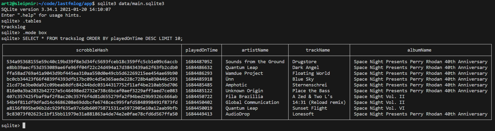

# LastfmLog

Command line tool to download your [Last.fm](https://last.fm) scrobbles *(played tracks)* data into a local database so you can do stuff with it.

---

## Requirements

- [Python](https://python.org) >= 3.9.2
- [Last.fm API account](https://www.last.fm/api/account/create)
- Optionally: [SQLite](https://sqlite.org) >= 3.14.1 command-line or similiar tools if you want to further process the database file.

---

## Installing

1. Copy the `app/` directory to a location on your system where your user has read/write access.

2. Copy `app/data/secrets.example.json` to `app/data/secrets.json` and open it in a text editor. Insert your Last.fm username as the `apiUser` value and your secret API key as the `apiKey` value. You can create your API credentials [here](https://www.last.fm/api/accounts).

3. Optionally, make `app/cli.py` executable so you can run it directly:


```bash
cd app/            # change into the app/ directory
chmod +x cli.py    # make the file executable
./cli.py           # run it
```

Alternatively, you can use the Python 3 binary on your system to run it:

```bash
cd app/           # change into the app/ directory
python3 cli.py    # run it
```

Both methods work; it's up to you. For the sake of simplicity in the documentation, it will be referred to as `cli.py` from now on.

---

## Usage

`cli.py Action [Options]...`

**Action** is mandatory, while **options** are optional.

You can always use `--help` or `-h` for a quick overview of the available options. For more detailed explanations, please continue reading.

### Actions

Only one action can be executed at a time.

#### update

Update the local database with data from the remote API. On the first run, all plays will be fetched. Afterward, only plays that are more recent than the last one stored in the local database will be fetched.  
Example:
```bash
cli.py update
# Fetching data page 1
# + The Gentle People - Journey (DMX Krew remix)
# + Insect Jazz - Wildflower
# + Patchwork - Frequencies
# Fetched 3 new tracks
# Skipped 0 tracks
```

#### stats

Generate statistics from the data in the local database.  
Example:
```bash
cli.py stats
# Stats saved to file: /home/user/lastfmlog/app/data/stats.json
```

#### reset

Delete everything in the local database.  
Example:
```bash
cli.py reset
# Reset database? [Y/n]: y
# Deleted 5495 tracks
```

### Options

Multiple options can be set at once.

#### (*global*) --datadir PATH

Override the default data directory path.  
Default: `app/data/`  
Example: `cli.py update --datadir /mnt/foo/mydatadir`

#### (*update*) --from UNIXTIME

Only fetch plays after this time.  
Default: *incremental update*  
Example: `cli.py update --from 1684443099`

#### (*update*) --to UNIXTIME

Only fetch plays before this time.  
Default: *incremental update*  
Example: `cli.py update --to 1684443099`

#### (*stats*) --obsoleteafter SECONDS

Set the time in seconds until the database is considered obsolete, and you will be asked if you want to update it first. Set to `-1` to disable this check.  
Default: `1800`  
Example: `cli.py stats --obsoleteafter 900`

#### (*stats*) --playsbyyearlimit NUMBER

Limit the number of items in *plays by year*.  
Default: *unlimited*  
Example: `cli.py stats --playsbyyearlimit 10`

#### (*stats*) --playsbymonthlimit NUMBER

Limit the number of items in *plays by month*.  
Default: *unlimited*  
Example: `cli.py stats --playsbymonthlimit 12`

#### (*stats*) --playsbydaylimit NUMBER

Limit the number of items in *plays by day*.  
Default: *unlimited*  
Example: `cli.py stats --playsbydaylimit 7`

#### (*stats*) --playsbyhourlimit NUMBER

Limit the number of items in *plays by hour*.  
Default: *unlimited*  
Example: `cli.py stats --playsbyhourlimit 24`

#### (*stats*) --topartistslimit NUMBER

Limit the number of items in *top artists*.  
Default: *unlimited*  
Example: `cli.py stats --topartistslimit 10`

#### (*stats*) --toptrackslimit NUMBER

Limit the number of items in *top tracks*.  
Default: *unlimited*  
Example: `cli.py stats --toptrackslimit 10`

#### (*stats*) --topalbumslimit NUMBER

Limit the number of items in *top albums*.  
Default: *unlimited*  
Example: `cli.py stats --topalbumslimit 10`

---

## Example Data/Output

The database file. Default path is `app/data/main.sqlite3`. For its schema see `query['dbSchema']` in `app/lib/query.py`.



### app/data/stats.json

The statistics file that will be created when you execute the `stats` action. Default path is `app/data/stats.json`.

```json
{
    "_statsUpdatedOn": 1684486257.8129718,
    "_databaseUpdatedOn": 1684485095.1636245,
    "_defaultQueryLimit": 5616,
    "playsTotal": 5616,
    "uniqueArtists": 1077,
    "uniqueTracks": 3075,
    "uniqueAlbums": 1274,
    "topArtists": [
        {
            "artist": "EtheReal Media™",
            "plays": 400
        },
        {
            "artist": "Romeo Rucha",
            "plays": 252
        },
        {
            "artist": "Spartalien",
            "plays": 186
        },
        {
            "artist": "Yuki Kajiura",
            "plays": 120
        },
        {
            "artist": "DJ Shadow",
            "plays": 91
        },
        {
            "artist": "Infinity Frequencies",
            "plays": 87
        },
        {
            "artist": "The Timewriter",
            "plays": 72
        },
        {
            "artist": "Tool",
            "plays": 66
        },
        {
            "artist": "Nas",
            "plays": 58
        },
        {
            "artist": "j^p^n",
            "plays": 51
        }
    ],
    "topTracks": [
        {
            "track": "In Memory Of You",
            "artist": "Yuki Kajiura",
            "plays": 16
        },
        {
            "track": "Dat's Cool",
            "artist": "DJ Unknown Face",
            "plays": 16
        },
        {
            "track": "Searchin'",
            "artist": "Dead Calm",
            "plays": 16
        },
        {
            "track": "One & Only",
            "artist": "PFM",
            "plays": 15
        },
        {
            "track": "Come On (Simon Templar Mix)",
            "artist": "Ballistic Brothers",
            "plays": 15
        },
        {
            "track": "Time Zone",
            "artist": "Space Link",
            "plays": 14
        },
        {
            "track": "Find Me",
            "artist": "Skanna",
            "plays": 14
        },
        {
            "track": "Nu Birth of Cool",
            "artist": "Omni Trio",
            "plays": 14
        },
        {
            "track": "The Lick",
            "artist": "Earl Grey",
            "plays": 14
        },
        {
            "track": "Speechless Drum & Bass (K&D Session)",
            "artist": "Count Basic",
            "plays": 14
        }
    ],
    "topAlbums": [
        {
            "album": "Conversions - A K&D Selection",
            "artist": "Various Artists",
            "plays": 145
        },
        {
            "album": "Aesthetic Vibes",
            "artist": "Various Artists",
            "plays": 141
        },
        {
            "album": "Stay Calm",
            "artist": "Romeo Rucha",
            "plays": 126
        },
        {
            "album": "We're Good",
            "artist": "Romeo Rucha",
            "plays": 126
        },
        {
            "album": "BIZCAS10: Ten Years of Business Casual",
            "artist": "Various Artists",
            "plays": 120
        },
        {
            "album": "Xen Cuts",
            "artist": "Various Artists",
            "plays": 117
        },
        {
            "album": "One Minute Massacre Volume 3",
            "artist": "Various Artists",
            "plays": 95
        },
        {
            "album": "Ｌａｔｅ Ｎｉｇｈｔ ＴＶ",
            "artist": "EtheReal Media™",
            "plays": 90
        },
        {
            "album": "Space Night Vol. 5",
            "artist": "Various Artists",
            "plays": 88
        },
        {
            "album": "Untold Stories",
            "artist": "Spartalien",
            "plays": 82
        }
    ],
    "playsByYear": [
        {
            "year": "2023",
            "plays": 5132
        },
        {
            "year": "2022",
            "plays": 486
        }
    ],
    "playsByMonth": [
        {
            "month": "2023-05",
            "plays": 1466
        },
        {
            "month": "2023-04",
            "plays": 1743
        },
        {
            "month": "2023-03",
            "plays": 508
        },
        {
            "month": "2023-02",
            "plays": 886
        },
        {
            "month": "2023-01",
            "plays": 529
        },
        {
            "month": "2022-12",
            "plays": 486
        }
    ],
    "playsByDay": [
        {
            "day": "2023-05-19",
            "plays": 2
        },
        {
            "day": "2023-05-18",
            "plays": 90
        },
        {
            "day": "2023-05-17",
            "plays": 84
        },
        {
            "day": "2023-05-16",
            "plays": 68
        },
        {
            "day": "2023-05-15",
            "plays": 92
        },
        {
            "day": "2023-05-14",
            "plays": 136
        },
        {
            "day": "2023-05-13",
            "plays": 232
        },
        {
            "day": "2023-05-12",
            "plays": 62
        },
        {
            "day": "2023-05-11",
            "plays": 55
        },
        {
            "day": "2023-05-10",
            "plays": 69
        }
    ],
    "playsByHour": [
        {
            "hour": "08",
            "day": "2023-05-19",
            "plays": 2
        },
        {
            "hour": "22",
            "day": "2023-05-18",
            "plays": 10
        },
        {
            "hour": "21",
            "day": "2023-05-18",
            "plays": 8
        },
        {
            "hour": "20",
            "day": "2023-05-18",
            "plays": 11
        },
        {
            "hour": "19",
            "day": "2023-05-18",
            "plays": 4
        },
        {
            "hour": "15",
            "day": "2023-05-18",
            "plays": 6
        },
        {
            "hour": "14",
            "day": "2023-05-18",
            "plays": 5
        },
        {
            "hour": "13",
            "day": "2023-05-18",
            "plays": 8
        },
        {
            "hour": "12",
            "day": "2023-05-18",
            "plays": 12
        },
        {
            "hour": "11",
            "day": "2023-05-18",
            "plays": 12
        }
    ]
}
```

---
